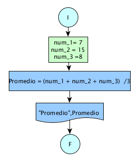

# Ejercicio 1

## Enunciado del Problema:
> Calcular el promedio de una lista de números proporcionados por el usuario.

## Análisis:
1. > Se solicitará al usuario una lista de números.
2. > Los números se sumarán.
3. > Se dividirá la suma total por la cantidad de números para obtener el promedio.
4. > Se mostrará el resultado al usuario.

## Diagrama de Flujo de Datos (DFD):

  

## Prueba de Escritorio:

<table style="float: left;border-collapse:collapse;border:none;margin-left:4.8pt;margin-right:4.8pt;">
    <tbody>
        <tr>
            <td style="width: 110.35pt;border-width: 1pt;border-style: solid;border-color: black black rgb(156, 194, 229);border-image: initial;background: rgb(180, 198, 231);padding: 0cm 5.4pt;vertical-align: top;">
                
<strong>num_1</strong>

            </td>
            <td style="width: 110.35pt;border-top: 1pt solid black;border-left: none;border-bottom: 1pt solid rgb(156, 194, 229);border-right: 1pt solid black;background: rgb(180, 198, 231);padding: 0cm 5.4pt;vertical-align: top;">
                
<strong>num_2</strong>

            </td>
            <td style="width: 110.35pt;border-top: 1pt solid black;border-left: none;border-bottom: 1pt solid rgb(156, 194, 229);border-right: 1pt solid black;background: rgb(180, 198, 231);padding: 0cm 5.4pt;vertical-align: top;">
                
<strong>num_3</strong>

            </td>
            <td style="width: 110.35pt;border-top: 1pt solid black;border-left: none;border-bottom: 1pt solid rgb(156, 194, 229);border-right: 1pt solid black;background: rgb(180, 198, 231);padding: 0cm 5.4pt;vertical-align: top;">
                
<strong>Promedio = (num_1 + num_2 + num_3) &nbsp;/3</strong>

            </td>
        </tr>
        <tr>
            <td style="width: 110.35pt;border-right: 1pt solid black;border-bottom: 1pt solid black;border-left: 1pt solid black;border-image: initial;border-top: none;background: rgb(222, 234, 246);padding: 0cm 5.4pt;vertical-align: top;">
                
7

            </td>
            <td style="width: 110.35pt;border-top: none;border-left: none;border-bottom: 1pt solid black;border-right: 1pt solid black;background: rgb(222, 234, 246);padding: 0cm 5.4pt;vertical-align: top;">
                
15

            </td>
            <td style="width: 110.35pt;border-top: none;border-left: none;border-bottom: 1pt solid black;border-right: 1pt solid black;background: rgb(222, 234, 246);padding: 0cm 5.4pt;vertical-align: top;">
                
8

            </td>
            <td style="width: 110.35pt;border-top: none;border-left: none;border-bottom: 1pt solid black;border-right: 1pt solid black;background: rgb(222, 234, 246);padding: 0cm 5.4pt;vertical-align: top;">
                
Promedio = (7+15+8)/3

                
=10

            </td>
        </tr>
    </tbody>
</table>

