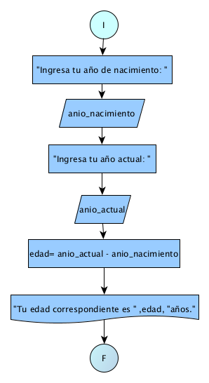

# Ejercicio 2 

## Enunciado del Problema:
> Diseñe un programa que permita a una persona ingresar su año de nacimiento y el año actual para calcular su edad.

## Análisis:
1. > El programa debe solicitar al usuario que ingrese su año de nacimiento y el año actual.
2. > Luego, el programa calculará la edad restando el año de nacimiento del año actual.
3. > Finalmente, mostrará la edad calculada al usuario.

## Diagrama de Flujo de Datos (DFD):

  

## Prueba de Escritorio:
<table style="border-collapse:collapse;border:none;">
    <tbody>
        <tr>
            <td style="width: 147.1pt;border-width: 1pt;border-style: solid;border-color: black black rgb(156, 194, 229);border-image: initial;background: rgb(180, 198, 231);padding: 0cm 5.4pt;vertical-align: top;">
                
<strong>anio_nacimiento</strong>

            </td>
            <td style="width: 147.15pt;border-top: 1pt solid black;border-left: none;border-bottom: 1pt solid rgb(156, 194, 229);border-right: 1pt solid black;background: rgb(180, 198, 231);padding: 0cm 5.4pt;vertical-align: top;">
                
<strong>anio_actual</strong>

            </td>
            <td style="width: 147.15pt;border-top: 1pt solid black;border-left: none;border-bottom: 1pt solid rgb(156, 194, 229);border-right: 1pt solid black;background: rgb(180, 198, 231);padding: 0cm 5.4pt;vertical-align: top;">
                
<strong>edad = anio_actual - anio_nacimiento</strong>

            </td>
        </tr>
        <tr>
            <td style="width: 147.1pt;border-right: 1pt solid black;border-bottom: 1pt solid black;border-left: 1pt solid black;border-image: initial;border-top: none;background: rgb(222, 234, 246);padding: 0cm 5.4pt;vertical-align: top;">
                
2005

            </td>
            <td style="width: 147.15pt;border-top: none;border-left: none;border-bottom: 1pt solid black;border-right: 1pt solid black;background: rgb(222, 234, 246);padding: 0cm 5.4pt;vertical-align: top;">
                
2023

            </td>
            <td style="width: 147.15pt;border-top: none;border-left: none;border-bottom: 1pt solid black;border-right: 1pt solid black;background: rgb(222, 234, 246);padding: 0cm 5.4pt;vertical-align: top;">
                
edad = 2023 -2005

                
edad = 18

            </td>
        </tr>
    </tbody>
</table>
