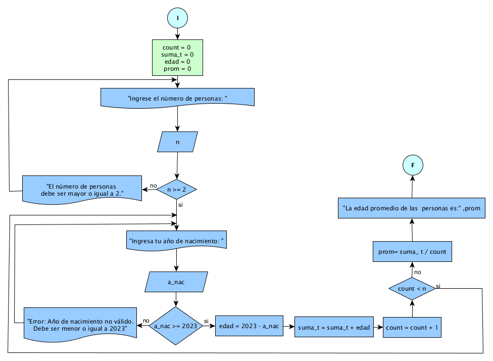

# Ejercicio 5 

## Enunciado del Problema:
> Diseñe un programa que permita calcular la edad promedio de n personas, solicitando el año de nacimiento de cada una de ellas y asumiendo que el año actual es 2023.

## Análisis:
1. > El programa debe solicitar al usuario la cantidad de personas (n) para las cuales se calculará el promedio de edad.
2. > Luego, el programa debe solicitar el año de nacimiento de cada persona.
3. > Para calcular la edad de cada persona, se restará el año de nacimiento del año actual (2023).
4. > Luego, se sumarán todas las edades y se calculará el promedio dividiendo la suma por n.
5. > Finalmente, el programa mostrará el promedio de edad al usuario.

## Diagrama de Flujo de Datos (DFD):

  

## Prueba de Escritorio:
<table style="border-collapse:collapse;border:none;">
    <tbody>
        <tr>
            <td style="width: 73.55pt;border-width: 1pt;border-style: solid;border-color: black black rgb(156, 194, 229);border-image: initial;background: rgb(180, 198, 231);padding: 0cm 5.4pt;vertical-align: top;">
                
<strong>count</strong>

            </td>
            <td style="width: 25.45pt;border-top: 1pt solid black;border-left: none;border-bottom: 1pt solid rgb(156, 194, 229);border-right: 1pt solid black;background: rgb(180, 198, 231);padding: 0cm 5.4pt;vertical-align: top;">
                
<strong>n</strong>

            </td>
            <td style="width: 77.95pt;border-top: 1pt solid black;border-left: none;border-bottom: 1pt solid rgb(156, 194, 229);border-right: 1pt solid black;background: rgb(180, 198, 231);padding: 0cm 5.4pt;vertical-align: top;">
                
<strong>n &gt;= 0</strong>

            </td>
            <td style="width: 49.6pt;border-top: 1pt solid black;border-left: none;border-bottom: 1pt solid rgb(156, 194, 229);border-right: 1pt solid black;background: rgb(180, 198, 231);padding: 0cm 5.4pt;vertical-align: top;">
                
<strong>num_p</strong>

            </td>
            <td style="width: 70.9pt;border-top: 1pt solid black;border-left: none;border-bottom: 1pt solid rgb(156, 194, 229);border-right: 1pt solid black;background: rgb(180, 198, 231);padding: 0cm 5.4pt;vertical-align: top;">
                
<strong>num_p &gt; 0</strong>

            </td>
            <td style="width: 143.95pt;border-top: 1pt solid black;border-left: none;border-bottom: 1pt solid rgb(156, 194, 229);border-right: 1pt solid black;background: rgb(180, 198, 231);padding: 0cm 5.4pt;vertical-align: top;">
                
<strong>suma_t += num_p</strong>

            </td>
        </tr>
        <tr>
            <td style="width: 73.55pt;border-right: 1pt solid black;border-bottom: 1pt solid black;border-left: 1pt solid black;border-image: initial;border-top: none;background: rgb(222, 234, 246);padding: 0cm 5.4pt;vertical-align: top;">
                
0

            </td>
            <td style="width: 25.45pt;border-top: none;border-left: none;border-bottom: 1pt solid black;border-right: 1pt solid black;background: rgb(222, 234, 246);padding: 0cm 5.4pt;vertical-align: top;">
                
2

            </td>
            <td style="width: 77.95pt;border-top: none;border-left: none;border-bottom: 1pt solid black;border-right: 1pt solid black;background: rgb(222, 234, 246);padding: 0cm 5.4pt;vertical-align: top;">
                
2 &gt;=0 /si

            </td>
            <td style="width: 49.6pt;border-top: none;border-left: none;border-bottom: 1pt solid black;border-right: 1pt solid black;background: rgb(222, 234, 246);padding: 0cm 5.4pt;vertical-align: top;">
                
10

                
10

            </td>
            <td style="width: 70.9pt;border-top: none;border-left: none;border-bottom: 1pt solid black;border-right: 1pt solid black;background: rgb(222, 234, 246);padding: 0cm 5.4pt;vertical-align: top;">
                
10 &gt; 0/si

                
10 &gt; 0/si

            </td>
            <td style="width: 143.95pt;border-top: none;border-left: none;border-bottom: 1pt solid black;border-right: 1pt solid black;background: rgb(222, 234, 246);padding: 0cm 5.4pt;vertical-align: top;">
                
suma_t = 0+10 = 10

                
suma_t = 10+10 = 20

            </td>
        </tr>
    </tbody>
</table>
<table style="border-collapse:collapse;border:none;">
    <tbody>
        <tr>
            <td style="width: 147.1pt;border-width: 1pt;border-style: solid;border-color: black black rgb(156, 194, 229);border-image: initial;background: rgb(180, 198, 231);padding: 0cm 5.4pt;vertical-align: top;">
                
<strong>count += 1</strong>

            </td>
            <td style="width: 147.15pt;border-top: 1pt solid black;border-left: none;border-bottom: 1pt solid rgb(156, 194, 229);border-right: 1pt solid black;background: rgb(180, 198, 231);padding: 0cm 5.4pt;vertical-align: top;">
                
<strong>count &lt; n</strong>

            </td>
            <td style="width: 147.15pt;border-top: 1pt solid black;border-left: none;border-bottom: 1pt solid rgb(156, 194, 229);border-right: 1pt solid black;background: rgb(180, 198, 231);padding: 0cm 5.4pt;vertical-align: top;">
                
<strong>prom = suma_t / count</strong>

            </td>
        </tr>
        <tr>
            <td style="width: 147.1pt;border-right: 1pt solid black;border-bottom: 1pt solid black;border-left: 1pt solid black;border-image: initial;border-top: none;background: rgb(222, 234, 246);padding: 0cm 5.4pt;vertical-align: top;">
                
count = 0+1 =1

                
count = 1+1 =1

            </td>
            <td style="width: 147.15pt;border-top: none;border-left: none;border-bottom: 1pt solid black;border-right: 1pt solid black;background: rgb(222, 234, 246);padding: 0cm 5.4pt;vertical-align: top;">
                
1 &lt; 2

                
2 &lt; 2 /no

            </td>
            <td style="width: 147.15pt;border-top: none;border-left: none;border-bottom: 1pt solid black;border-right: 1pt solid black;background: rgb(222, 234, 246);padding: 0cm 5.4pt;vertical-align: top;">
                
&nbsp;

                
prom = 20 / 2

                
prom = 10

            </td>
        </tr>
    </tbody>
</table>
