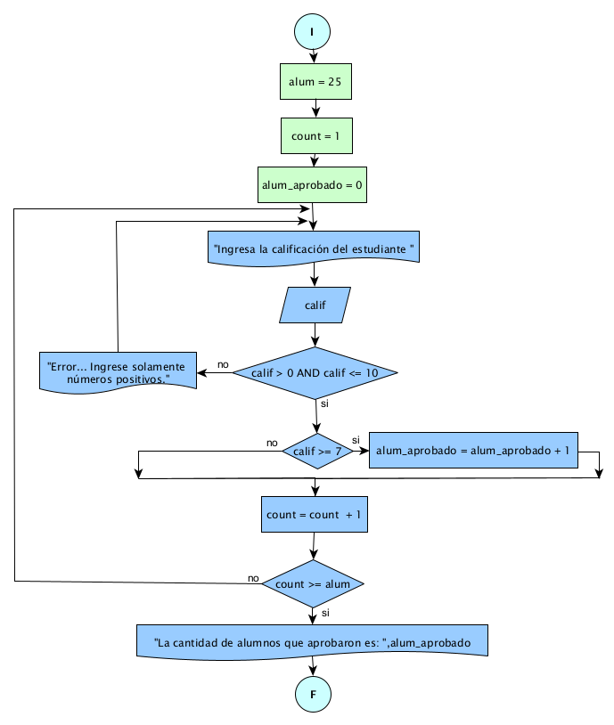

# Ejercicio 6 

## Enunciado del Problema:
> Se desea saber la cantidad de alumnos que pasarían una materia en la que hay 25 alumnos, y la calificación aprobatoria es de 7.

## Análisis:
1. > El programa debe solicitar la calificación de cada uno de los 25 alumnos.
2. > Luego, el programa debe verificar si la calificación de cada alumno es mayor o igual a 7 (la calificación aprobatoria).
3. > Si la calificación es mayor o igual a 7, se considera que el alumno ha aprobado.
4. > El programa debe contar cuántos alumnos han aprobado y mostrar ese númer

## Diagrama de Flujo de Datos (DFD):

  

## Prueba de Escritorio

<table style="border-collapse:collapse;border:none;">
    <tbody>
        <tr>
            <td style="width: 71.6pt;border-width: 1pt;border-style: solid;border-color: black black rgb(156, 194, 229);border-image: initial;background: rgb(180, 198, 231);padding: 0cm 5.4pt;vertical-align: top;">
                
<strong>alum</strong>

            </td>
            <td style="width: 71.75pt;border-top: 1pt solid black;border-left: none;border-bottom: 1pt solid rgb(156, 194, 229);border-right: 1pt solid black;background: rgb(180, 198, 231);padding: 0cm 5.4pt;vertical-align: top;">
                
<strong>count</strong>

            </td>
            <td style="width: 83.45pt;border-top: 1pt solid black;border-left: none;border-bottom: 1pt solid rgb(156, 194, 229);border-right: 1pt solid black;background: rgb(180, 198, 231);padding: 0cm 5.4pt;vertical-align: top;">
                
<strong>alum_aprobado</strong>

            </td>
            <td style="width: 42.3pt;border-top: 1pt solid black;border-left: none;border-bottom: 1pt solid rgb(156, 194, 229);border-right: 1pt solid black;background: rgb(180, 198, 231);padding: 0cm 5.4pt;vertical-align: top;">
                
<strong>calif</strong>

            </td>
            <td style="width: 100.8pt;border-top: 1pt solid black;border-left: none;border-bottom: 1pt solid rgb(156, 194, 229);border-right: 1pt solid black;background: rgb(180, 198, 231);padding: 0cm 5.4pt;vertical-align: top;">
                
<strong>calif &gt; 0 AND calif &lt;=10</strong>

            </td>
            <td style="width: 71.5pt;border-top: 1pt solid black;border-left: none;border-bottom: 1pt solid rgb(156, 194, 229);border-right: 1pt solid black;background: rgb(180, 198, 231);padding: 0cm 5.4pt;vertical-align: top;">
                
<strong>calif &gt;7</strong>

            </td>
        </tr>
        <tr>
            <td style="width: 71.6pt;border-right: 1pt solid black;border-bottom: 1pt solid black;border-left: 1pt solid black;border-image: initial;border-top: none;background: rgb(222, 234, 246);padding: 0cm 5.4pt;vertical-align: top;">
                
3

            </td>
            <td style="width: 71.75pt;border-top: none;border-left: none;border-bottom: 1pt solid black;border-right: 1pt solid black;background: rgb(222, 234, 246);padding: 0cm 5.4pt;vertical-align: top;">
                
1

                
2

                
3

            </td>
            <td style="width: 83.45pt;border-top: none;border-left: none;border-bottom: 1pt solid black;border-right: 1pt solid black;background: rgb(222, 234, 246);padding: 0cm 5.4pt;vertical-align: top;">
                
0

                
1

                
2

                
3

            </td>
            <td style="width: 42.3pt;border-top: none;border-left: none;border-bottom: 1pt solid black;border-right: 1pt solid black;background: rgb(222, 234, 246);padding: 0cm 5.4pt;vertical-align: top;">
                
9

                
9

                
9

            </td>
            <td style="width: 100.8pt;border-top: none;border-left: none;border-bottom: 1pt solid black;border-right: 1pt solid black;background: rgb(222, 234, 246);padding: 0cm 5.4pt;vertical-align: top;">
                
9&gt; 0 AND 9 &lt;=10/si

                
9&gt; 0 AND 9 &lt;=10/si

                
9&gt; 0 AND 9&lt;=10/si

            </td>
            <td style="width: 71.5pt;border-top: none;border-left: none;border-bottom: 1pt solid black;border-right: 1pt solid black;background: rgb(222, 234, 246);padding: 0cm 5.4pt;vertical-align: top;">
                
9&gt;7/si

                
9&gt;7/si

                
9&gt;7/si

            </td>
        </tr>
    </tbody>
</table>
<table style="border-collapse:collapse;border:none;">
    <tbody>
        <tr>
            <td style="width: 147.1pt;border-width: 1pt;border-style: solid;border-color: black black rgb(156, 194, 229);border-image: initial;background: rgb(180, 198, 231);padding: 0cm 5.4pt;vertical-align: top;">
                
<strong>si=count +=1</strong>

            </td>
            <td style="width: 147.15pt;border-top: 1pt solid black;border-left: none;border-bottom: 1pt solid rgb(156, 194, 229);border-right: 1pt solid black;background: rgb(180, 198, 231);padding: 0cm 5.4pt;vertical-align: top;">
                
<strong>count &gt;= alum</strong>

            </td>
            <td style="width: 147.15pt;border-top: 1pt solid black;border-left: none;border-bottom: 1pt solid rgb(156, 194, 229);border-right: 1pt solid black;background: rgb(180, 198, 231);padding: 0cm 5.4pt;vertical-align: top;">
                
<strong>alum_aprobado</strong>

            </td>
        </tr>
        <tr>
            <td style="width: 147.1pt;border-right: 1pt solid black;border-bottom: 1pt solid black;border-left: 1pt solid black;border-image: initial;border-top: none;background: rgb(222, 234, 246);padding: 0cm 5.4pt;vertical-align: top;">
                
count = 0+1=1

                
count= 1+1=2

                
count= 2+1=3

                
count= 3+1=4

            </td>
            <td style="width: 147.15pt;border-top: none;border-left: none;border-bottom: 1pt solid black;border-right: 1pt solid black;background: rgb(222, 234, 246);padding: 0cm 5.4pt;vertical-align: top;">
                
1&gt;=3

                
2&gt;=3

                
3&gt;=3

                
4&gt;=3

            </td>
            <td style="width: 147.15pt;border-top: none;border-left: none;border-bottom: 1pt solid black;border-right: 1pt solid black;background: rgb(222, 234, 246);padding: 0cm 5.4pt;vertical-align: top;">
                
3

            </td>
        </tr>
    </tbody>
</table>