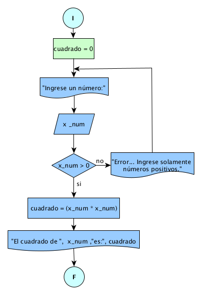

# Ejercicio 7 

## Enunciado del Problema:
> Diseñe un programa que calcule el cuadrado de un número positivo ingresado por el usuario desde el teclado.

## Análisis:
1. > El programa debe solicitar al usuario que ingrese un número.
2. > Luego, el programa verificará si el número ingresado es positivo.
3. > Si el número es positivo, calculará el cuadrado de ese número.
4. > Finalmente, mostrará el cuadrado calculado al usuario.

## Diagrama de Flujo de Datos (DFD):

  

## Prueba de Escritorio:
<table style="border-collapse:collapse;border:none;">
    <tbody>
        <tr>
            <td style="width: 110.35pt;border-width: 1pt;border-style: solid;border-color: black black rgb(156, 194, 229);border-image: initial;background: rgb(180, 198, 231);padding: 0cm 5.4pt;vertical-align: top;">
                
<strong>cuadrado&nbsp;</strong>

            </td>
            <td style="width: 110.35pt;border-top: 1pt solid black;border-left: none;border-bottom: 1pt solid rgb(156, 194, 229);border-right: 1pt solid black;background: rgb(180, 198, 231);padding: 0cm 5.4pt;vertical-align: top;">
                
<strong>x_num</strong>

            </td>
            <td style="width: 110.35pt;border-top: 1pt solid black;border-left: none;border-bottom: 1pt solid rgb(156, 194, 229);border-right: 1pt solid black;background: rgb(180, 198, 231);padding: 0cm 5.4pt;vertical-align: top;">
                
<strong>x_num</strong>

            </td>
            <td style="width: 110.35pt;border-top: 1pt solid black;border-left: none;border-bottom: 1pt solid rgb(156, 194, 229);border-right: 1pt solid black;background: rgb(180, 198, 231);padding: 0cm 5.4pt;vertical-align: top;">
                
<strong>cuadrado = x_num * x_num</strong>

            </td>
        </tr>
        <tr>
            <td style="width: 110.35pt;border-right: 1pt solid black;border-bottom: 1pt solid black;border-left: 1pt solid black;border-image: initial;border-top: none;background: rgb(222, 234, 246);padding: 0cm 5.4pt;vertical-align: top;">
                
<strong>0</strong>

                
<strong>4</strong>

            </td>
            <td style="width: 110.35pt;border-top: none;border-left: none;border-bottom: 1pt solid black;border-right: 1pt solid black;background: rgb(222, 234, 246);padding: 0cm 5.4pt;vertical-align: top;">
                
2

            </td>
            <td style="width: 110.35pt;border-top: none;border-left: none;border-bottom: 1pt solid black;border-right: 1pt solid black;background: rgb(222, 234, 246);padding: 0cm 5.4pt;vertical-align: top;">
                
2&gt;0/si

            </td>
            <td style="width: 110.35pt;border-top: none;border-left: none;border-bottom: 1pt solid black;border-right: 1pt solid black;background: rgb(222, 234, 246);padding: 0cm 5.4pt;vertical-align: top;">
                
cuadrado = 2 * 2

                
=4

            </td>
        </tr>
    </tbody>
</table>
