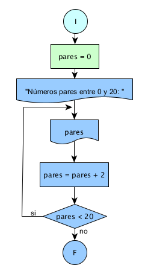

# Ejercicio 8 

## Enunciado del Problema:
> Encontrar y mostrar los números pares en el rango de 0 a 20.

## Análisis:
1. > El programa debe iterar a través de los números del 0 al 20.
2. > Para cada número en ese rango, se debe verificar si es par.
3. > Si un número es par, se debe mostrar en la salida.

## Diagrama de Flujo de Datos (DFD):

  

## Prueba de Escritorio
<table style="border-collapse:collapse;border:none;">
    <tbody>
        <tr>
            <td style="width: 147.1pt;border-width: 1pt;border-style: solid;border-color: black black rgb(156, 194, 229);border-image: initial;background: rgb(180, 198, 231);padding: 0cm 5.4pt;vertical-align: top;">
                
<strong>pares</strong>

            </td>
            <td style="width: 147.15pt;border-top: 1pt solid black;border-left: none;border-bottom: 1pt solid rgb(156, 194, 229);border-right: 1pt solid black;background: rgb(180, 198, 231);padding: 0cm 5.4pt;vertical-align: top;">
                
<strong>pares = pares +2</strong>

            </td>
            <td style="width: 147.15pt;border-top: 1pt solid black;border-left: none;border-bottom: 1pt solid rgb(156, 194, 229);border-right: 1pt solid black;background: rgb(180, 198, 231);padding: 0cm 5.4pt;vertical-align: top;">
                
<strong>pares &lt;=20</strong>

            </td>
        </tr>
        <tr>
            <td style="width: 147.1pt;border-right: 1pt solid black;border-bottom: 1pt solid black;border-left: 1pt solid black;border-image: initial;border-top: none;background: rgb(222, 234, 246);padding: 0cm 5.4pt;height: 161.35pt;vertical-align: top;">
                
<strong>0</strong>

                
<strong>2</strong>

                
<strong>4</strong>

                
<strong>6</strong>

                
<strong>8</strong>

                
<strong>10</strong>

                
<strong>12</strong>

                
<strong>14</strong>

                
<strong>16</strong>

                
<strong>18</strong>

                
<strong>20</strong>

            </td>
            <td style="width: 147.15pt;border-top: none;border-left: none;border-bottom: 1pt solid black;border-right: 1pt solid black;background: rgb(222, 234, 246);padding: 0cm 5.4pt;height: 161.35pt;vertical-align: top;">
                
pares = 0 +2=2

                
pares = 2 +2=4

                
pares = 4 +2=6

                
pares = 6 +2=8

                
pares = 8 +2=10

                
pares =10 +2=12

                
pares = 12 +2=14

                
pares = 14 +2=16

                
pares = 16 +2=18

                
pares = 18 +2 =20

                
pares = 20 +2 =22

            </td>
            <td style="width: 147.15pt;border-top: none;border-left: none;border-bottom: 1pt solid black;border-right: 1pt solid black;background: rgb(222, 234, 246);padding: 0cm 5.4pt;height: 161.35pt;vertical-align: top;">
                
2 &lt;= 20

                
2 &lt;= 20

                
2 &lt;= 20

                
2 &lt;= 20

                
2 &lt;= 20

                
2 &lt;= 20

                
2 &lt;= 20

                
2 &lt;= 20

                
2 &lt;= 20

                
20 &lt;= 20

                
22 &lt;=20 / no/

                

                Impresion 20 -Fin

            </td>
        </tr>
    </tbody>
</table>