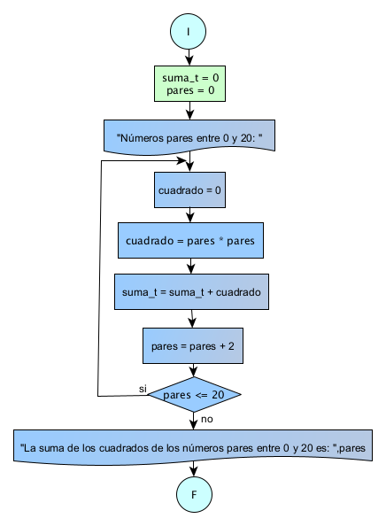

# Ejercicio 9 

## Enunciado del Problema:
> Calcular la suma de los cuadrados de los números pares en el rango de 0 a 20 de manera consecutiva.

## Análisis:
1. > El programa debe iterar a través de los números del 0 al 20.
2. > Para cada número en ese rango, se debe verificar si es par.
3. > Si un número es par, calcular su cuadrado.
4. > Sumar los cuadrados de los números pares consecutivos.
5. > Mostrar el resultado de la suma.

## Diagrama de Flujo de Datos (DFD):

  

## Prueba de Escritorio
## Diagrama de Flujo de Datos (DFD):

<table style="border-collapse:collapse;border:none;">
    <tbody>
        <tr>
            <td style="width: 35.85pt;border-width: 1pt;border-style: solid;border-color: black black rgb(156, 194, 229);border-image: initial;background: rgb(180, 198, 231);padding: 0cm 5.4pt;vertical-align: top;">
                
<strong>pares</strong>

            </td>
            <td style="width: 56.05pt;border-top: 1pt solid black;border-left: none;border-bottom: 1pt solid rgb(156, 194, 229);border-right: 1pt solid black;background: rgb(180, 198, 231);padding: 0cm 5.4pt;vertical-align: top;">
                
<strong>cuadrado</strong>

            </td>
            <td style="width: 3cm;border-top: 1pt solid black;border-left: none;border-bottom: 1pt solid rgb(156, 194, 229);border-right: 1pt solid black;background: rgb(180, 198, 231);padding: 0cm 5.4pt;vertical-align: top;">
                
<strong>cuadrado =pares *pares</strong>

            </td>
            <td style="width: 92.15pt;border-top: 1pt solid black;border-left: none;border-bottom: 1pt solid rgb(156, 194, 229);border-right: 1pt solid black;background: rgb(180, 198, 231);padding: 0cm 5.4pt;vertical-align: top;">
                
<strong>suma_t+= cuadrado</strong>

            </td>
            <td style="width: 92.15pt;border-top: 1pt solid black;border-left: none;border-bottom: 1pt solid rgb(156, 194, 229);border-right: 1pt solid black;background: rgb(180, 198, 231);padding: 0cm 5.4pt;vertical-align: top;">
                
<strong>pares = pares +2</strong>

            </td>
            <td style="width: 80.15pt;border-top: 1pt solid black;border-left: none;border-bottom: 1pt solid rgb(156, 194, 229);border-right: 1pt solid black;background: rgb(180, 198, 231);padding: 0cm 5.4pt;vertical-align: top;">
                
<strong>pares &lt;=20</strong>

            </td>
        </tr>
        <tr>
            <td style="width: 35.85pt;border-right: 1pt solid black;border-bottom: 1pt solid black;border-left: 1pt solid black;border-image: initial;border-top: none;background: rgb(222, 234, 246);padding: 0cm 5.4pt;vertical-align: top;">
                
0

                
2

                
4

                
6

                
8

                
10

                
12

                
14

                
16

                
18

                
20

            </td>
            <td style="width: 56.05pt;border-top: none;border-left: none;border-bottom: 1pt solid black;border-right: 1pt solid black;background: rgb(222, 234, 246);padding: 0cm 5.4pt;vertical-align: top;">
                
0

                
4

                
16

                
36

                
64

                
100

                
144

                
196

                
256

                
324

                
400

            </td>
            <td style="width: 3cm;border-top: none;border-left: none;border-bottom: 1pt solid black;border-right: 1pt solid black;background: rgb(222, 234, 246);padding: 0cm 5.4pt;vertical-align: top;">
                
=2 = 4

                
=4 * 4 = 16

                
=6 * 6 = 36

                
=8 * 8 = 64

                
=10 * 10 = 100

                
=12 * 12 = 144

                
=14 * 14 = 196

                
=16 * 16 = 256

                
=18 * 18 = 324

                
=20 * 20 = 400

            </td>
            <td style="width: 92.15pt;border-top: none;border-left: none;border-bottom: 1pt solid black;border-right: 1pt solid black;background: rgb(222, 234, 246);padding: 0cm 5.4pt;vertical-align: top;">
                
0 + 4 = 4

                
4 + 16 = 20

                
20 + 36 = 56

                
56 + 64 = 120

                
120 + 100 = 220

                
220 + 144 = 364

                
364 + 196 = 560

                
560 + 256 = 816

                
816 + 324 = 1140

                
1140 + 400 = 1540

            </td>
            <td style="width: 92.15pt;border-top: none;border-left: none;border-bottom: 1pt solid black;border-right: 1pt solid black;background: rgb(222, 234, 246);padding: 0cm 5.4pt;vertical-align: top;">
                
pares = 0 +2=2

                
pares = 2 +2=4

                
pares = 4 +2=6

                
pares = 6 +2=8

                
pares = 8 +2=10

                
pares =10 +2=12

                
pares = 12 +2=14

                
pares = 14 +2=16

                
pares = 16 +2=18

                
pares = 18 +2 =20

                
pares = 20 +2 =22

            </td>
            <td style="width: 80.15pt;border-top: none;border-left: none;border-bottom: 1pt solid black;border-right: 1pt solid black;background: rgb(222, 234, 246);padding: 0cm 5.4pt;vertical-align: top;">
                
2 &lt;= 20

                
2 &lt;= 20

                
2 &lt;= 20

                
2 &lt;= 20

                
2 &lt;= 20

                
2 &lt;= 20

                
2 &lt;= 20

                
2 &lt;= 20

                
2 &lt;= 20

                
20 &lt;= 20

                
22 &lt;=20 /no/

                
Fin

            </td>
        </tr>
    </tbody>
</table>
