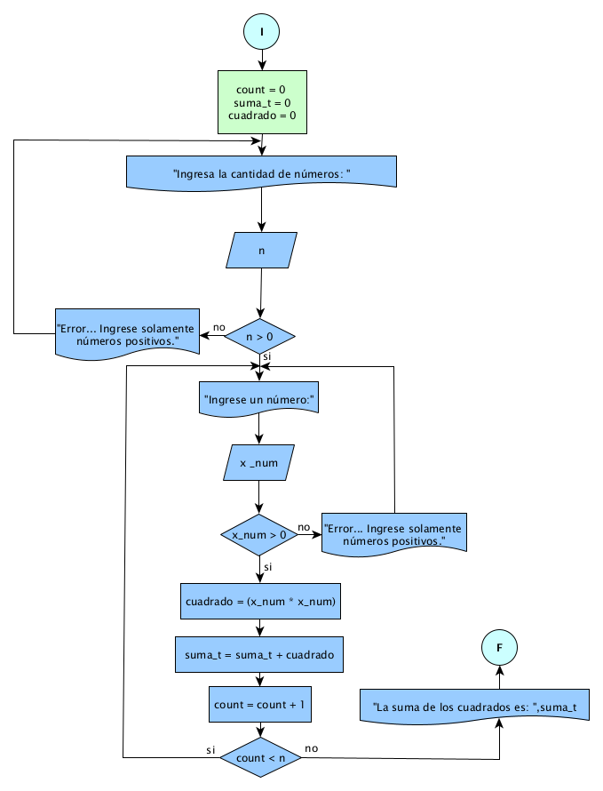

# Ejercicio 10 

## Enunciado del Problema:
> Obtener la suma de los cuadrados de n números capturados por el usuario.

## Análisis:
1. > El programa debe solicitar al usuario la cantidad de números (n) que desea ingresar.
2. > Luego, el programa debe solicitar al usuario que ingrese n números.
3. > Para cada número ingresado, calcular su cuadrado.
4. > Sumar los cuadrados de los n números.
5. > Mostrar el resultado de la suma.

## Diagrama de Flujo de Datos (DFD):

  

## Prueba de Escritorio
<table style="border-collapse:collapse;border:none;">
    <tbody>
        <tr>
            <td style="width: 54.1pt;border-width: 1pt;border-style: solid;border-color: black black rgb(156, 194, 229);border-image: initial;background: rgb(180, 198, 231);padding: 0cm 5.4pt;vertical-align: top;">
                
<strong>cuadrado&nbsp;</strong>

            </td>
            <td style="width: 20.55pt;border-top: 1pt solid black;border-left: none;border-bottom: 1pt solid rgb(156, 194, 229);border-right: 1pt solid black;background: rgb(180, 198, 231);padding: 0cm 5.4pt;vertical-align: top;">
                
<strong>n</strong>

            </td>
            <td style="width: 30.65pt;border-top: 1pt solid black;border-left: none;border-bottom: 1pt solid rgb(156, 194, 229);border-right: 1pt solid black;background: rgb(180, 198, 231);padding: 0cm 5.4pt;vertical-align: top;">
                
<strong>n&gt;0</strong>

            </td>
            <td style="width: 42.1pt;border-top: 1pt solid black;border-left: none;border-bottom: 1pt solid rgb(156, 194, 229);border-right: 1pt solid black;background: rgb(180, 198, 231);padding: 0cm 5.4pt;vertical-align: top;">
                
<strong>x_num</strong>

            </td>
            <td style="width: 46.65pt;border-top: 1pt solid black;border-left: none;border-bottom: 1pt solid rgb(156, 194, 229);border-right: 1pt solid black;background: rgb(180, 198, 231);padding: 0cm 5.4pt;vertical-align: top;">
                
<strong>x_num &gt;0</strong>

            </td>
            <td style="width: 76.7pt;border-top: 1pt solid black;border-left: none;border-bottom: 1pt solid rgb(156, 194, 229);border-right: 1pt solid black;background: rgb(180, 198, 231);padding: 0cm 5.4pt;vertical-align: top;">
                
<strong>cuadrado = x_num * x_num</strong>

            </td>
            <td style="width: 55.45pt;border-top: 1pt solid black;border-left: none;border-bottom: 1pt solid rgb(156, 194, 229);border-right: 1pt solid black;background: rgb(180, 198, 231);padding: 0cm 5.4pt;vertical-align: top;">
                
<strong>Suma_m += cuadrado</strong>

            </td>
            <td style="width: 55.35pt;border-top: 1pt solid black;border-left: none;border-bottom: 1pt solid rgb(156, 194, 229);border-right: 1pt solid black;background: rgb(180, 198, 231);padding: 0cm 5.4pt;vertical-align: top;">
                
<strong>count+=1</strong>

            </td>
            <td style="width: 59.85pt;border-top: 1pt solid black;border-left: none;border-bottom: 1pt solid rgb(156, 194, 229);border-right: 1pt solid black;background: rgb(180, 198, 231);padding: 0cm 5.4pt;vertical-align: top;">
                
<strong>count &lt; n</strong>

            </td>
        </tr>
        <tr>
            <td style="width: 54.1pt;border-right: 1pt solid black;border-bottom: 1pt solid black;border-left: 1pt solid black;border-image: initial;border-top: none;background: rgb(222, 234, 246);padding: 0cm 5.4pt;vertical-align: top;">
                
0

                
4

                
8

            </td>
            <td style="width: 20.55pt;border-top: none;border-left: none;border-bottom: 1pt solid black;border-right: 1pt solid black;background: rgb(222, 234, 246);padding: 0cm 5.4pt;vertical-align: top;">
                
2

                
&nbsp;

            </td>
            <td style="width: 30.65pt;border-top: none;border-left: none;border-bottom: 1pt solid black;border-right: 1pt solid black;background: rgb(222, 234, 246);padding: 0cm 5.4pt;vertical-align: top;">
                
2&gt;0/si

            </td>
            <td style="width: 42.1pt;border-top: none;border-left: none;border-bottom: 1pt solid black;border-right: 1pt solid black;background: rgb(222, 234, 246);padding: 0cm 5.4pt;vertical-align: top;">
                
2

                
2

            </td>
            <td style="width: 46.65pt;border-top: none;border-left: none;border-bottom: 1pt solid black;border-right: 1pt solid black;background: rgb(222, 234, 246);padding: 0cm 5.4pt;vertical-align: top;">
                
2 &gt;0 /si

                
2 &gt;0 /si

            </td>
            <td style="width: 76.7pt;border-top: none;border-left: none;border-bottom: 1pt solid black;border-right: 1pt solid black;background: rgb(222, 234, 246);padding: 0cm 5.4pt;vertical-align: top;">
                
= 2 * 2 = 4

                
= 2 * 2 = 4

            </td>
            <td style="width: 55.45pt;border-top: none;border-left: none;border-bottom: 1pt solid black;border-right: 1pt solid black;background: rgb(222, 234, 246);padding: 0cm 5.4pt;vertical-align: top;">
                
=0 + 4 =4

                
=4 + 4 =8

            </td>
            <td style="width: 55.35pt;border-top: none;border-left: none;border-bottom: 1pt solid black;border-right: 1pt solid black;background: rgb(222, 234, 246);padding: 0cm 5.4pt;vertical-align: top;">
                
=0+1 =1

                
=1+1 =2

                
<u>&nbsp;</u>

            </td>
            <td style="width: 59.85pt;border-top: none;border-left: none;border-bottom: 1pt solid black;border-right: 1pt solid black;background: rgb(222, 234, 246);padding: 0cm 5.4pt;vertical-align: top;">
                
1&lt;2/si

                
2&lt;2/no

            </td>
        </tr>
    </tbody>
</table>