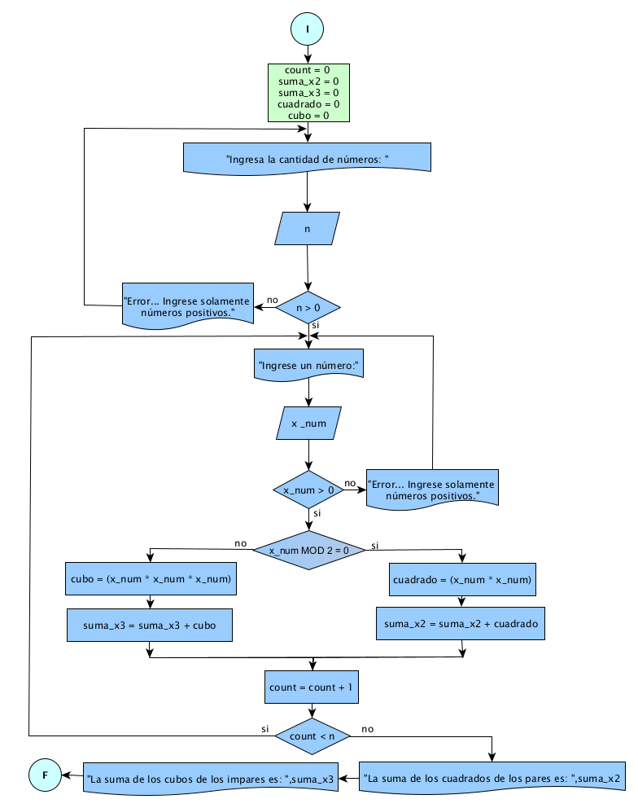

# Ejercicio 11

## Enunciado del Problema:
> Diseñar un programa que capture n números positivos ingresados por el usuario, luego calcule la suma de los cuadrados de los números pares y la suma de los cubos de los números impares.

## Análisis:
1. > El programa debe solicitar al usuario la cantidad de números (n) que desea ingresar.
2. > Luego, el programa debe solicitar al usuario que ingrese n números.
3. > Para cada número ingresado, verificar si es par o impar.
4. > Si es par, calcular su cuadrado y sumarlo a la suma de cuadrados.
5. > Si es impar, calcular su cubo y sumarlo a la suma de cubos.
6. > Mostrar la suma de cuadrados y la suma de cubos.

## Diagrama de Flujo de Datos (DFD):

  

## Prueba de Escritorio

<table style="width:439.2pt;border-collapse:collapse;border:none;">
    <tbody>
        <tr>
            <td style="width: 53.6pt;border-width: 1pt;border-style: solid;border-color: black black rgb(156, 194, 229);border-image: initial;background: rgb(180, 198, 231);padding: 0cm 5.4pt;height: 43.35pt;vertical-align: top;">
                
<strong>cuadrado&nbsp;</strong>

            </td>
            <td style="width: 33.15pt;border-top: 1pt solid black;border-left: none;border-bottom: 1pt solid rgb(156, 194, 229);border-right: 1pt solid black;background: rgb(180, 198, 231);padding: 0cm 5.4pt;height: 43.35pt;vertical-align: top;">
                
<strong>cubo</strong>

            </td>
            <td style="width: 18.8pt;border-top: 1pt solid black;border-left: none;border-bottom: 1pt solid rgb(156, 194, 229);border-right: 1pt solid black;background: rgb(180, 198, 231);padding: 0cm 5.4pt;height: 43.35pt;vertical-align: top;">
                
<strong>n</strong>

            </td>
            <td style="width: 42.1pt;border-top: 1pt solid black;border-left: none;border-bottom: 1pt solid rgb(156, 194, 229);border-right: 1pt solid black;background: rgb(180, 198, 231);padding: 0cm 5.4pt;height: 43.35pt;vertical-align: top;">
                
<strong>x_num</strong>

            </td>
            <td style="width: 59.35pt;border-top: 1pt solid black;border-left: none;border-bottom: 1pt solid rgb(156, 194, 229);border-right: 1pt solid black;background: rgb(180, 198, 231);padding: 0cm 5.4pt;height: 43.35pt;vertical-align: top;">
                
<strong>x_num &gt;0</strong>

            </td>
            <td style="width: 62.1pt;border-top: 1pt solid black;border-left: none;border-bottom: 1pt solid rgb(156, 194, 229);border-right: 1pt solid black;background: rgb(180, 198, 231);padding: 0cm 5.4pt;height: 43.35pt;vertical-align: top;">
                
<strong>x_num MOD 2=0</strong>

            </td>
            <td style="width: 69.45pt;border-top: 1pt solid black;border-left: none;border-bottom: 1pt solid rgb(156, 194, 229);border-right: 1pt solid black;background: rgb(180, 198, 231);padding: 0cm 5.4pt;height: 43.35pt;vertical-align: top;">
                
<strong>si/cuadrado = x_num * x_num&nbsp;</strong>

            </td>
            <td style="width: 100.65pt;border-top: 1pt solid black;border-left: none;border-bottom: 1pt solid rgb(156, 194, 229);border-right: 1pt solid black;background: rgb(180, 198, 231);padding: 0cm 5.4pt;height: 43.35pt;vertical-align: top;">
                
<strong>suma_x2 = suma_x2 + cuadrado</strong>

            </td>
        </tr>
        <tr>
            <td style="width: 53.6pt;border-right: 1pt solid black;border-bottom: 1pt solid black;border-left: 1pt solid black;border-image: initial;border-top: none;background: rgb(222, 234, 246);padding: 0cm 5.4pt;height: 43.35pt;vertical-align: top;">
                
0

                
4

                
<strong>&nbsp;</strong>

            </td>
            <td style="width: 33.15pt;border-top: none;border-left: none;border-bottom: 1pt solid black;border-right: 1pt solid black;background: rgb(222, 234, 246);padding: 0cm 5.4pt;height: 43.35pt;vertical-align: top;">
                
0

                
9

            </td>
            <td style="width: 18.8pt;border-top: none;border-left: none;border-bottom: 1pt solid black;border-right: 1pt solid black;background: rgb(222, 234, 246);padding: 0cm 5.4pt;height: 43.35pt;vertical-align: top;">
                
2

                
&nbsp;

            </td>
            <td style="width: 42.1pt;border-top: none;border-left: none;border-bottom: 1pt solid black;border-right: 1pt solid black;background: rgb(222, 234, 246);padding: 0cm 5.4pt;height: 43.35pt;vertical-align: top;">
                
2

                
3

            </td>
            <td style="width: 59.35pt;border-top: none;border-left: none;border-bottom: 1pt solid black;border-right: 1pt solid black;background: rgb(222, 234, 246);padding: 0cm 5.4pt;height: 43.35pt;vertical-align: top;">
                
2 &gt;0 /si

                
2 &gt;0 /si

            </td>
            <td style="width: 62.1pt;border-top: none;border-left: none;border-bottom: 1pt solid black;border-right: 1pt solid black;background: rgb(222, 234, 246);padding: 0cm 5.4pt;height: 43.35pt;vertical-align: top;">
                
2 % 2 = 0

                
3 % 2 = 1

            </td>
            <td style="width: 69.45pt;border-top: none;border-left: none;border-bottom: 1pt solid black;border-right: 1pt solid black;background: rgb(222, 234, 246);padding: 0cm 5.4pt;height: 43.35pt;vertical-align: top;">
                
= 2 * 2 = 4

                
&nbsp;

            </td>
            <td style="width: 100.65pt;border-top: none;border-left: none;border-bottom: 1pt solid black;border-right: 1pt solid black;background: rgb(222, 234, 246);padding: 0cm 5.4pt;height: 43.35pt;vertical-align: top;">
                
=0 + 4 =4

                
&nbsp;

            </td>
        </tr>
    </tbody>
</table>
<table style="border-collapse:collapse;border:none;">
    <tbody>
        <tr>
            <td style="width: 118.15pt;border-width: 1pt;border-style: solid;border-color: black black rgb(156, 194, 229);border-image: initial;background: rgb(180, 198, 231);padding: 0cm 5.4pt;vertical-align: top;">
                
<strong>no/cubo = (x_num * x_num * x_num)</strong>

            </td>
            <td style="width: 87.15pt;border-top: 1pt solid black;border-left: none;border-bottom: 1pt solid rgb(156, 194, 229);border-right: 1pt solid black;background: rgb(180, 198, 231);padding: 0cm 5.4pt;vertical-align: top;">
                
<strong>suma_x3 = suma_x3 + cubo</strong>

            </td>
            <td style="width: 63.8pt;border-top: 1pt solid black;border-left: none;border-bottom: 1pt solid rgb(156, 194, 229);border-right: 1pt solid black;background: rgb(180, 198, 231);padding: 0cm 5.4pt;vertical-align: top;">
                
<strong>count+=1</strong>

            </td>
            <td style="width: 77.95pt;border-top: 1pt solid black;border-left: none;border-bottom: 1pt solid rgb(156, 194, 229);border-right: 1pt solid black;background: rgb(180, 198, 231);padding: 0cm 5.4pt;vertical-align: top;">
                
<strong>count &lt; n</strong>

            </td>
        </tr>
        <tr>
            <td style="width: 118.15pt;border-right: 1pt solid black;border-bottom: 1pt solid black;border-left: 1pt solid black;border-image: initial;border-top: none;background: rgb(222, 234, 246);padding: 0cm 5.4pt;vertical-align: top;">
                
<strong>&nbsp;</strong>

                
=3 * 3 =9

            </td>
            <td style="width: 87.15pt;border-top: none;border-left: none;border-bottom: 1pt solid black;border-right: 1pt solid black;background: rgb(222, 234, 246);padding: 0cm 5.4pt;vertical-align: top;">
                
&nbsp;

                
=0 + 9 = 9

            </td>
            <td style="width: 63.8pt;border-top: none;border-left: none;border-bottom: 1pt solid black;border-right: 1pt solid black;background: rgb(222, 234, 246);padding: 0cm 5.4pt;vertical-align: top;">
                
=0+1 =1

                
=1+1 =2

                
&nbsp;

            </td>
            <td style="width: 77.95pt;border-top: none;border-left: none;border-bottom: 1pt solid black;border-right: 1pt solid black;background: rgb(222, 234, 246);padding: 0cm 5.4pt;vertical-align: top;">
                
1&lt;2/si

                
2&lt;2/no

            </td>
        </tr>
    </tbody>
</table>

