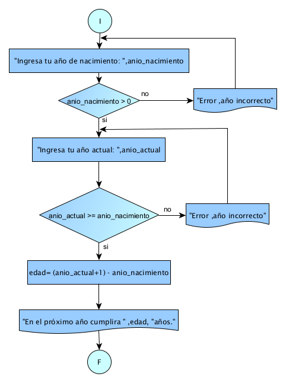

# Ejercicio 12 

## Enunciado del Problema:
> Diseñar un DFD que, dado el año de nacimiento de una persona, indique cuántos años cumplirá esa persona el año siguiente.

## Análisis:
1. > El programa debe solicitar al usuario que ingrese su año de nacimiento.
2. > Luego, el programa debe calcular la edad de la persona en el año siguiente (anio_actual + 1).
3. > Mostrar la edad calculada.

## Diagrama de Flujo de Datos (DFD):

  

## Prueba de Escritorio:

<table style="border-collapse:collapse;border:none;">
    <tbody>
        <tr>
            <td style="width: 87.5pt;border-width: 1pt;border-style: solid;border-color: black black rgb(156, 194, 229);border-image: initial;background: rgb(180, 198, 231);padding: 0cm 5.4pt;vertical-align: top;">
                
<strong>anio_nacimiento</strong>

            </td>
            <td style="width: 103.65pt;border-top: 1pt solid black;border-left: none;border-bottom: 1pt solid rgb(156, 194, 229);border-right: 1pt solid black;background: rgb(180, 198, 231);padding: 0cm 5.4pt;vertical-align: top;">
                
<strong>anio_nacimiento &gt;0</strong>

            </td>
            <td style="width: 57.35pt;border-top: 1pt solid black;border-left: none;border-bottom: 1pt solid rgb(156, 194, 229);border-right: 1pt solid black;background: rgb(180, 198, 231);padding: 0cm 5.4pt;vertical-align: top;">
                
<strong>anio_actual</strong>

            </td>
            <td style="width: 87.5pt;border-top: 1pt solid black;border-left: none;border-bottom: 1pt solid rgb(156, 194, 229);border-right: 1pt solid black;background: rgb(180, 198, 231);padding: 0cm 5.4pt;vertical-align: top;">
                
<strong>anio_actual &gt;= anio_nacimiento</strong>

            </td>
            <td style="width: 105.4pt;border-top: 1pt solid black;border-left: none;border-bottom: 1pt solid rgb(156, 194, 229);border-right: 1pt solid black;background: rgb(180, 198, 231);padding: 0cm 5.4pt;vertical-align: top;">
                
<strong>edad = (anio_actual +1) - anio_nacimiento</strong>

            </td>
        </tr>
        <tr>
            <td style="width: 87.5pt;border-right: 1pt solid black;border-bottom: 1pt solid black;border-left: 1pt solid black;border-image: initial;border-top: none;background: rgb(222, 234, 246);padding: 0cm 5.4pt;vertical-align: top;">
                
2005

            </td>
            <td style="width: 103.65pt;border-top: none;border-left: none;border-bottom: 1pt solid black;border-right: 1pt solid black;background: rgb(222, 234, 246);padding: 0cm 5.4pt;vertical-align: top;">
                
2005 &gt; 0 / si

            </td>
            <td style="width: 57.35pt;border-top: none;border-left: none;border-bottom: 1pt solid black;border-right: 1pt solid black;background: rgb(222, 234, 246);padding: 0cm 5.4pt;vertical-align: top;">
                
2023

            </td>
            <td style="width: 87.5pt;border-top: none;border-left: none;border-bottom: 1pt solid black;border-right: 1pt solid black;background: rgb(222, 234, 246);padding: 0cm 5.4pt;vertical-align: top;">
                
2023 &gt;= 2005 / si

            </td>
            <td style="width: 105.4pt;border-top: none;border-left: none;border-bottom: 1pt solid black;border-right: 1pt solid black;background: rgb(222, 234, 246);padding: 0cm 5.4pt;vertical-align: top;">
                
= (2023+1) -2005

                
= 2024 -2005

                
= 19

            </td>
        </tr>
    </tbody>
</table>

