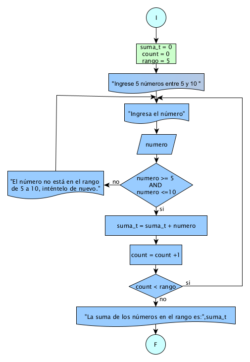

# Ejercicio 13 

## Enunciado del Problema:
> Diseñar un programa que capture 5 números entre 5 y 10 inclusive y calcule la suma de estos números.

## Análisis:
1. > El programa debe solicitar al usuario que ingrese 5 números.
2. > Para cada número ingresado, verificar si está dentro del rango de 5 a 10 (inclusive).
3. > Si un número está dentro de ese rango, sumarlo a la suma total.
4. > Mostrar la suma total de los números válidos.

## Diagrama de Flujo de Datos (DFD):

  

## Prueba de Escritorio

<table style="border-collapse:collapse;border:none;">
    <tbody>
        <tr>
            <td style="width: 88.25pt;border-width: 1pt;border-style: solid;border-color: black black rgb(156, 194, 229);border-image: initial;background: rgb(180, 198, 231);padding: 0cm 5.4pt;vertical-align: top;">
                
<strong>suma_t</strong>

            </td>
            <td style="width: 53.25pt;border-top: 1pt solid black;border-left: none;border-bottom: 1pt solid rgb(156, 194, 229);border-right: 1pt solid black;background: rgb(180, 198, 231);padding: 0cm 5.4pt;vertical-align: top;">
                
<strong>count</strong>

            </td>
            <td style="width: 49.65pt;border-top: 1pt solid black;border-left: none;border-bottom: 1pt solid rgb(156, 194, 229);border-right: 1pt solid black;background: rgb(180, 198, 231);padding: 0cm 5.4pt;vertical-align: top;">
                
<strong>rango</strong>

            </td>
            <td style="width: 77.95pt;border-top: 1pt solid black;border-left: none;border-bottom: 1pt solid rgb(156, 194, 229);border-right: 1pt solid black;background: rgb(180, 198, 231);padding: 0cm 5.4pt;vertical-align: top;">
                
<strong>numero</strong>

            </td>
            <td style="width: 172.3pt;border-top: 1pt solid black;border-left: none;border-bottom: 1pt solid rgb(156, 194, 229);border-right: 1pt solid black;background: rgb(180, 198, 231);padding: 0cm 5.4pt;vertical-align: top;">
                
<strong>numero &gt;= 5 AND numero &lt;=10</strong>

            </td>
        </tr>
        <tr>
            <td style="width: 88.25pt;border-right: 1pt solid black;border-bottom: 1pt solid black;border-left: 1pt solid black;border-image: initial;border-top: none;background: rgb(222, 234, 246);padding: 0cm 5.4pt;vertical-align: top;">
                
0

                
5

                
10

                
16

                
22

                
29

            </td>
            <td style="width: 53.25pt;border-top: none;border-left: none;border-bottom: 1pt solid black;border-right: 1pt solid black;background: rgb(222, 234, 246);padding: 0cm 5.4pt;vertical-align: top;">
                
0

                
1

                
2

                
3

                
4

                
5

            </td>
            <td style="width: 49.65pt;border-top: none;border-left: none;border-bottom: 1pt solid black;border-right: 1pt solid black;background: rgb(222, 234, 246);padding: 0cm 5.4pt;vertical-align: top;">
                
5

            </td>
            <td style="width: 77.95pt;border-top: none;border-left: none;border-bottom: 1pt solid black;border-right: 1pt solid black;background: rgb(222, 234, 246);padding: 0cm 5.4pt;vertical-align: top;">
                
5

                
5

                
6

                
6

                
7

            </td>
            <td style="width: 172.3pt;border-top: none;border-left: none;border-bottom: 1pt solid black;border-right: 1pt solid black;background: rgb(222, 234, 246);padding: 0cm 5.4pt;vertical-align: top;">
                
5&gt;= 5 *** 5 &lt;=10

                
5&gt;= 5 AND 5 &lt;=10

                
6&gt;= 5 &nbsp;*** 6 &lt;=10

                
6&gt;= 5 AND 6 &lt;=10

                
7&gt;= 5 AND 7&lt;=10

            </td>
        </tr>
    </tbody>
</table>
<table style="border-collapse:collapse;border:none;">
    <tbody>
        <tr>
            <td style="width: 147.1pt;border-width: 1pt;border-style: solid;border-color: black black rgb(156, 194, 229);border-image: initial;background: rgb(180, 198, 231);padding: 0cm 5.4pt;vertical-align: top;">
                
<strong>suma_t = suma_t + numero</strong>

            </td>
            <td style="width: 147.15pt;border-top: 1pt solid black;border-left: none;border-bottom: 1pt solid rgb(156, 194, 229);border-right: 1pt solid black;background: rgb(180, 198, 231);padding: 0cm 5.4pt;vertical-align: top;">
                
<strong>***** = count +1</strong>

            </td>
            <td style="width: 147.15pt;border-top: 1pt solid black;border-left: none;border-bottom: 1pt solid rgb(156, 194, 229);border-right: 1pt solid black;background: rgb(180, 198, 231);padding: 0cm 5.4pt;vertical-align: top;">
                
<strong>count &lt; rango</strong>

            </td>
        </tr>
        <tr>
            <td style="width: 147.1pt;border-right: 1pt solid black;border-bottom: 1pt solid black;border-left: 1pt solid black;border-image: initial;border-top: none;background: rgb(222, 234, 246);padding: 0cm 5.4pt;vertical-align: top;">
                
=0 + 5 = 5

                
=5 + 5 =10

                
=10 + 6 = 16

                
=16 + 6 = 22

                
=22 + 7 = 29

            </td>
            <td style="width: 147.15pt;border-top: none;border-left: none;border-bottom: 1pt solid black;border-right: 1pt solid black;background: rgb(222, 234, 246);padding: 0cm 5.4pt;vertical-align: top;">
                
=0+1 =1

                
=1+1 =2

                
=2+1 =3

                
=3+1 =4

                
=4+1 =5

            </td>
            <td style="width: 147.15pt;border-top: none;border-left: none;border-bottom: 1pt solid black;border-right: 1pt solid black;background: rgb(222, 234, 246);padding: 0cm 5.4pt;vertical-align: top;">
                
<strong>1&lt;5</strong>

                
<strong>2&lt;5</strong>

                
<strong>3&lt;5</strong>

                
<strong>4&lt;5</strong>

                
<strong>5&lt;5</strong>

            </td>
        </tr>
    </tbody>
</table>
