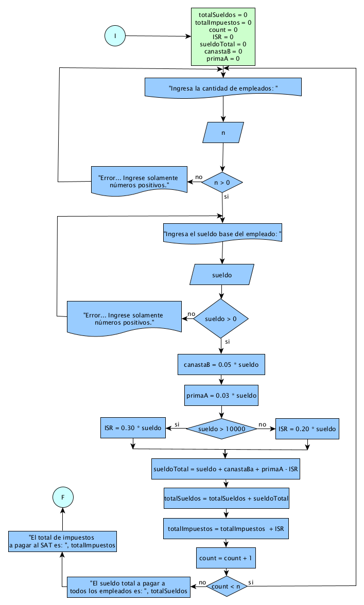

# Ejercicio 14 

## Enunciado del Problema:
> Una empresa desea calcular el sueldo total de una persona considerando las siguientes percepciones y deducciones: sueldo base, 5% de canasta básica, 3% de prima de antigüedad si el salario base excede los 10,000 pesos. El ISR (Impuesto Sobre la Renta) es del 30% si el salario base excede los 10,000 pesos, y del 20% si es menor. Se requiere calcular el total de la nómina a pagar y los impuestos que el empleador debe pagar al SAT.

## Análisis:
1. > El programa debe solicitar al usuario que ingrese el numero de empleados.
2. > Asi como tambien debe , ingresar el sueldo base de la persona.
3. > Calcular el 5% de canasta básica sobre el sueldo base.
4. > Calcular el 3% de prima de antigüedad si el sueldo base es mayor a 10,000 pesos.
5. > Calcular el ISR (Impuesto Sobre la Renta) dependiendo del sueldo base.
6. > Calcular el sueldo total restando las deducciones al sueldo base.
7. > Calcular los impuestos que el empleador debe pagar al SAT.
8. > Haci hasta que se cumpla el total de empleados
9. > Y al final mostrar el sueldo total y los impuestos.

 
 
 
 
 
 

## Diagrama de Flujo de Datos (DFD):

  

## Prueba de Escritorio:

<table style="border-collapse:collapse;border:none;">
    <tbody>
        <tr>
            <td style="width: 39.45pt;border-width: 1pt;border-style: solid;border-color: black black rgb(156, 194, 229);border-image: initial;background: rgb(180, 198, 231);padding: 0cm 5.4pt;vertical-align: top;">
                
<strong>count</strong>

            </td>
            <td style="width: 71.15pt;border-top: 1pt solid black;border-left: none;border-bottom: 1pt solid rgb(156, 194, 229);border-right: 1pt solid black;background: rgb(180, 198, 231);padding: 0cm 5.4pt;vertical-align: top;">
                
<strong>totalSueldos</strong>

            </td>
            <td style="width: 71.15pt;border-top: 1pt solid black;border-left: none;border-bottom: 1pt solid rgb(156, 194, 229);border-right: 1pt solid black;background: rgb(180, 198, 231);padding: 0cm 5.4pt;vertical-align: top;">
                
<strong>totalImpuestos</strong>

            </td>
            <td style="width: 74.05pt;border-top: 1pt solid black;border-left: none;border-bottom: 1pt solid rgb(156, 194, 229);border-right: 1pt solid black;background: rgb(180, 198, 231);padding: 0cm 5.4pt;vertical-align: top;">
                
<strong>n</strong>

            </td>
            <td style="width: 57.3pt;border-top: 1pt solid black;border-left: none;border-bottom: 1pt solid rgb(156, 194, 229);border-right: 1pt solid black;background: rgb(180, 198, 231);padding: 0cm 5.4pt;vertical-align: top;">
                
<strong>n&gt;0</strong>

            </td>
            <td style="width: 64.15pt;border-top: 1pt solid black;border-left: none;border-bottom: 1pt solid rgb(156, 194, 229);border-right: 1pt solid black;background: rgb(180, 198, 231);padding: 0cm 5.4pt;vertical-align: top;">
                
<strong>sueldo</strong>

            </td>
            <td style="width: 64.15pt;border-top: 1pt solid black;border-left: none;border-bottom: 1pt solid rgb(156, 194, 229);border-right: 1pt solid black;background: rgb(180, 198, 231);padding: 0cm 5.4pt;vertical-align: top;">
                
<strong>sueldo &gt; 0</strong>

            </td>
        </tr>
        <tr>
            <td style="width: 39.45pt;border-right: 1pt solid black;border-bottom: 1pt solid black;border-left: 1pt solid black;border-image: initial;border-top: none;background: rgb(222, 234, 246);padding: 0cm 5.4pt;vertical-align: top;">
                
0

                
1

                
2

            </td>
            <td style="width: 71.15pt;border-top: none;border-left: none;border-bottom: 1pt solid black;border-right: 1pt solid black;background: rgb(222, 234, 246);padding: 0cm 5.4pt;vertical-align: top;">
                
0

                
8600

                
24200

            </td>
            <td style="width: 71.15pt;border-top: none;border-left: none;border-bottom: 1pt solid black;border-right: 1pt solid black;background: rgb(222, 234, 246);padding: 0cm 5.4pt;vertical-align: top;">
                
0

                
2000

                
8000

            </td>
            <td style="width: 74.05pt;border-top: none;border-left: none;border-bottom: 1pt solid black;border-right: 1pt solid black;background: rgb(222, 234, 246);padding: 0cm 5.4pt;vertical-align: top;">
                
2

            </td>
            <td style="width: 57.3pt;border-top: none;border-left: none;border-bottom: 1pt solid black;border-right: 1pt solid black;background: rgb(222, 234, 246);padding: 0cm 5.4pt;vertical-align: top;">
                
2&gt;0 /si

            </td>
            <td style="width: 64.15pt;border-top: none;border-left: none;border-bottom: 1pt solid black;border-right: 1pt solid black;background: rgb(222, 234, 246);padding: 0cm 5.4pt;vertical-align: top;">
                
10000

            </td>
            <td style="width: 64.15pt;border-top: none;border-left: none;border-bottom: 1pt solid black;border-right: 1pt solid black;background: rgb(222, 234, 246);padding: 0cm 5.4pt;vertical-align: top;">
                
10000 &gt; 0 si

            </td>
        </tr>
    </tbody>
</table>

<strong>&nbsp;</strong>

<table style="border-collapse:collapse;border:none;">
    <tbody>
        <tr>
            <td style="width: 99pt;border-width: 1pt;border-style: solid;border-color: black black rgb(156, 194, 229);border-image: initial;background: rgb(180, 198, 231);padding: 0cm 5.4pt;vertical-align: top;">
                
<strong>canastaB = 0.05 * sueldo</strong>

            </td>
            <td style="width: 100.45pt;border-top: 1pt solid black;border-left: none;border-bottom: 1pt solid rgb(156, 194, 229);border-right: 1pt solid black;background: rgb(180, 198, 231);padding: 0cm 5.4pt;vertical-align: top;">
                
<strong>primaA = 0.03 * sueldo</strong>

            </td>
            <td style="width: 72.05pt;border-top: 1pt solid black;border-left: none;border-bottom: 1pt solid rgb(156, 194, 229);border-right: 1pt solid black;background: rgb(180, 198, 231);padding: 0cm 5.4pt;vertical-align: top;">
                
<strong>sueldo &gt; 1000</strong>

            </td>
            <td style="width: 85.75pt;border-top: 1pt solid black;border-left: none;border-bottom: 1pt solid rgb(156, 194, 229);border-right: 1pt solid black;background: rgb(180, 198, 231);padding: 0cm 5.4pt;vertical-align: top;">
                
<strong>si/ ISR = 0.30 * sueldo</strong>

            </td>
            <td style="width: 84.15pt;border-top: 1pt solid black;border-left: none;border-bottom: 1pt solid rgb(156, 194, 229);border-right: 1pt solid black;background: rgb(180, 198, 231);padding: 0cm 5.4pt;vertical-align: top;">
                
<strong>no/ ISR = 0.20 * sueldo</strong>

            </td>
        </tr>
        <tr>
            <td style="width: 99pt;border-right: 1pt solid black;border-bottom: 1pt solid black;border-left: 1pt solid black;border-image: initial;border-top: none;background: rgb(222, 234, 246);padding: 0cm 5.4pt;vertical-align: top;">
                
=10000 *0.05&nbsp;

                
= 500

                
=20000 *0.05&nbsp;

                
= 1000

            </td>
            <td style="width: 100.45pt;border-top: none;border-left: none;border-bottom: 1pt solid black;border-right: 1pt solid black;background: rgb(222, 234, 246);padding: 0cm 5.4pt;vertical-align: top;">
                
=10000 *0.03 =300

                
=20000 *0.03&nbsp;

                
= 600

                
&nbsp;

            </td>
            <td style="width: 72.05pt;border-top: none;border-left: none;border-bottom: 1pt solid black;border-right: 1pt solid black;background: rgb(222, 234, 246);padding: 0cm 5.4pt;vertical-align: top;">
                
10000&gt;10000

                
si

                
20000&gt;10000

                
si

            </td>
            <td style="width: 85.75pt;border-top: none;border-left: none;border-bottom: 1pt solid black;border-right: 1pt solid black;background: rgb(222, 234, 246);padding: 0cm 5.4pt;vertical-align: top;">
                
&nbsp;

                
&nbsp;

                
=0.30 * 20000

                
=6000

            </td>
            <td style="width: 84.15pt;border-top: none;border-left: none;border-bottom: 1pt solid black;border-right: 1pt solid black;background: rgb(222, 234, 246);padding: 0cm 5.4pt;vertical-align: top;">
                
= 0.20 * 10000 =2000

            </td>
        </tr>
    </tbody>
</table>
<table style="border-collapse:collapse;border:none;">
    <tbody>
        <tr>
            <td style="width: 88.25pt;border-width: 1pt;border-style: solid;border-color: black black rgb(156, 194, 229);border-image: initial;background: rgb(180, 198, 231);padding: 0cm 5.4pt;vertical-align: top;">
                
<strong>sueldoTotal = sueldo + canastaBa + primaA - ISR</strong>

            </td>
            <td style="width: 88.25pt;border-top: 1pt solid black;border-left: none;border-bottom: 1pt solid rgb(156, 194, 229);border-right: 1pt solid black;background: rgb(180, 198, 231);padding: 0cm 5.4pt;vertical-align: top;">
                
<strong>************ = totalSueldos + sueldoTotal</strong>

            </td>
            <td style="width: 88.3pt;border-top: 1pt solid black;border-left: none;border-bottom: 1pt solid rgb(156, 194, 229);border-right: 1pt solid black;background: rgb(180, 198, 231);padding: 0cm 5.4pt;vertical-align: top;">
                
<strong>totalImpuestos = totalImpuestos &nbsp;+ ISR</strong>

            </td>
            <td style="width: 88.3pt;border-top: 1pt solid black;border-left: none;border-bottom: 1pt solid rgb(156, 194, 229);border-right: 1pt solid black;background: rgb(180, 198, 231);padding: 0cm 5.4pt;vertical-align: top;">
                
<strong>count = count + 1</strong>

            </td>
            <td style="width: 88.3pt;border-top: 1pt solid black;border-left: none;border-bottom: 1pt solid rgb(156, 194, 229);border-right: 1pt solid black;background: rgb(180, 198, 231);padding: 0cm 5.4pt;vertical-align: top;">
                
<strong>count &lt; n</strong>

            </td>
        </tr>
        <tr>
            <td style="width: 88.25pt;border-right: 1pt solid black;border-bottom: 1pt solid black;border-left: 1pt solid black;border-image: initial;border-top: none;background: rgb(222, 234, 246);padding: 0cm 5.4pt;vertical-align: top;">
                
= 10000 + 500 +300 -2000

                
= 20000 + 1000 +600 -6000

            </td>
            <td style="width: 88.25pt;border-top: none;border-left: none;border-bottom: 1pt solid black;border-right: 1pt solid black;background: rgb(222, 234, 246);padding: 0cm 5.4pt;vertical-align: top;">
                
= 0 +8600

                
=8600

                
= 8600 + 15600

                
=24200

            </td>
            <td style="width: 88.3pt;border-top: none;border-left: none;border-bottom: 1pt solid black;border-right: 1pt solid black;background: rgb(222, 234, 246);padding: 0cm 5.4pt;vertical-align: top;">
                
&nbsp;= 0 +2000

                
= 2000

                
= 2000 + 6000

                
= 8000

            </td>
            <td style="width: 88.3pt;border-top: none;border-left: none;border-bottom: 1pt solid black;border-right: 1pt solid black;background: rgb(222, 234, 246);padding: 0cm 5.4pt;vertical-align: top;">
                
=0+1 =1

                
=1+1 =2

                
<strong>&nbsp;</strong>

            </td>
            <td style="width: 88.3pt;border-top: none;border-left: none;border-bottom: 1pt solid black;border-right: 1pt solid black;background: rgb(222, 234, 246);padding: 0cm 5.4pt;vertical-align: top;">
                
1&lt;2/si

                
2&lt;2/no

            </td>
        </tr>
    </tbody>
</table>
