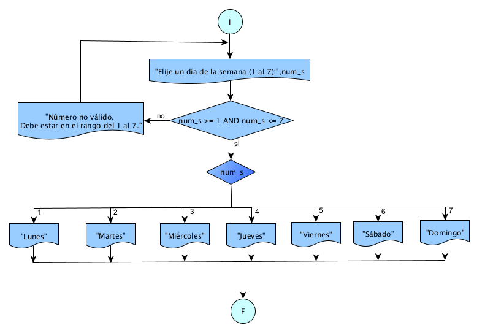

# Ejercicio 15 

## Enunciado del Problema:
> Diseñar un programa que determine el día de la semana a partir de un número del 1 al 7, donde 1 representa el lunes, 2 el martes, y así sucesivamente hasta 7 que representa el domingo.

## Análisis:
1. > El programa debe solicitar al usuario que ingrese un número del 1 al 7.
2. > De acuerdo con el número ingresado, determinar el día de la semana correspondiente.
3. > Mostrar el día de la semana.

## Diagrama de Flujo de Datos (DFD):

  

## Prueba de Escritorio
<table style="border-collapse:collapse;border:none;">
    <tbody>
        <tr>
            <td style="width: 108.15pt;border-width: 1pt;border-style: solid;border-color: black black rgb(156, 194, 229);border-image: initial;background: rgb(180, 198, 231);padding: 0cm 5.4pt;vertical-align: top;">
                
<strong>num_s</strong>

            </td>
            <td style="width: 168.05pt;border-top: 1pt solid black;border-left: none;border-bottom: 1pt solid rgb(156, 194, 229);border-right: 1pt solid black;background: rgb(180, 198, 231);padding: 0cm 5.4pt;vertical-align: top;">
                
<strong>num_s &gt;= 1 AND num_s &lt;= 7</strong>

            </td>
            <td style="width: 163pt;border-top: 1pt solid black;border-left: none;border-bottom: 1pt solid rgb(156, 194, 229);border-right: 1pt solid black;background: rgb(180, 198, 231);padding: 0cm 5.4pt;vertical-align: top;">
                
<strong>num_S</strong>

            </td>
        </tr>
        <tr>
            <td style="width: 108.15pt;border-right: 1pt solid black;border-bottom: 1pt solid black;border-left: 1pt solid black;border-image: initial;border-top: none;background: rgb(222, 234, 246);padding: 0cm 5.4pt;vertical-align: top;">
                
5

            </td>
            <td style="width: 168.05pt;border-top: none;border-left: none;border-bottom: 1pt solid black;border-right: 1pt solid black;background: rgb(222, 234, 246);padding: 0cm 5.4pt;vertical-align: top;">
                
5 &gt;=1 AND 1&lt;=7&nbsp;

                
Si

            </td>
            <td style="width: 163pt;border-top: none;border-left: none;border-bottom: 1pt solid black;border-right: 1pt solid black;background: rgb(222, 234, 246);padding: 0cm 5.4pt;vertical-align: top;">
                
5 = Viernes&nbsp;

            </td>
        </tr>
    </tbody>
</table>

