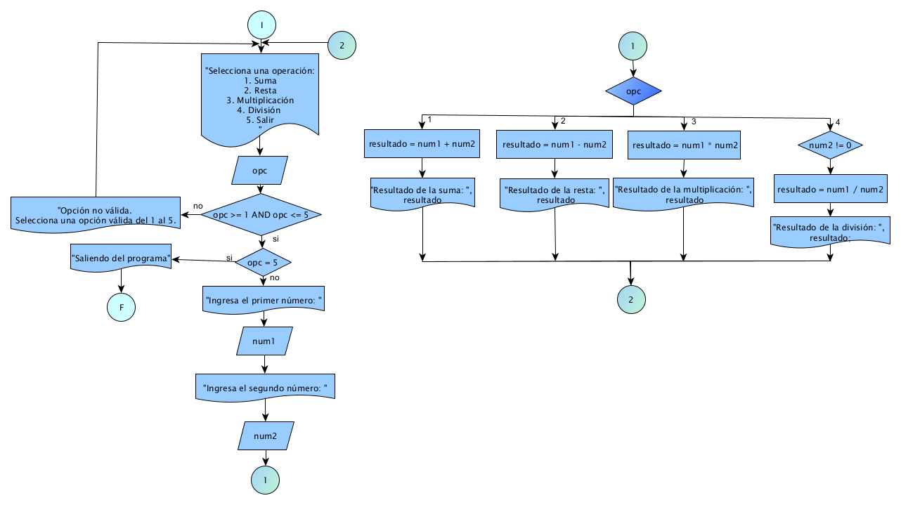

# Ejercicio 17

## Enunciado del Problema:
> Crear DFD con  un menú para una calculadora funcional que permita al usuario seleccionar el tipo de operación (suma, resta, multiplicación o división) y proporcionar dos números para realizar la operación.

## Análisis:
1. > El programa debe mostrar un menú al usuario para que seleccione el tipo de operación que desea realizar (suma, resta, multiplicación o división).
2. > Luego, el programa debe solicitar al usuario que ingrese dos números.
3. > Dependiendo de la operación seleccionada, realizar la operación correspondiente y mostrar el resultado.
4. > Y el ciclo sigue hasta que el usuario quiera salir con el numero igresado del teclado numero 5.

## Diagrama de Flujo de Datos (DFD):

  

## Prueba de Escritorio:
<table style="border-collapse:collapse;border:none;">
    <tbody>
        <tr>
            <td style="width: 147.1pt;border-width: 1pt;border-style: solid;border-color: black black rgb(156, 194, 229);border-image: initial;background: rgb(180, 198, 231);padding: 0cm 5.4pt;vertical-align: top;">
                
<strong>opc</strong>

            </td>
            <td style="width: 147.15pt;border-top: 1pt solid black;border-left: none;border-bottom: 1pt solid rgb(156, 194, 229);border-right: 1pt solid black;background: rgb(180, 198, 231);padding: 0cm 5.4pt;vertical-align: top;">
                
<strong>opc&gt;= 1 AND opc &lt;=5</strong>

            </td>
            <td style="width: 147.15pt;border-top: 1pt solid black;border-left: none;border-bottom: 1pt solid rgb(156, 194, 229);border-right: 1pt solid black;background: rgb(180, 198, 231);padding: 0cm 5.4pt;vertical-align: top;">
                
<strong>opc == 5</strong>

            </td>
        </tr>
        <tr>
            <td style="width: 147.1pt;border-right: 1pt solid black;border-bottom: 1pt solid black;border-left: 1pt solid black;border-image: initial;border-top: none;background: rgb(222, 234, 246);padding: 0cm 5.4pt;vertical-align: top;">
                
1

                
2

                
5

            </td>
            <td style="width: 147.15pt;border-top: none;border-left: none;border-bottom: 1pt solid black;border-right: 1pt solid black;background: rgb(222, 234, 246);padding: 0cm 5.4pt;vertical-align: top;">
                
1&gt;= AND opc 1&lt;= 5 /si

                
2&gt;= AND opc 2&lt;= 5 /si

                
5&gt;= AND opc 5&lt;= 5 /si

                
&nbsp;

            </td>
            <td style="width: 147.15pt;border-top: none;border-left: none;border-bottom: 1pt solid black;border-right: 1pt solid black;background: rgb(222, 234, 246);padding: 0cm 5.4pt;vertical-align: top;">
                
1 == 5 /no

                
2 == 5 /no

                
5 == 5 /si

            </td>
        </tr>
    </tbody>
</table>

<strong>&nbsp;</strong>

<table style="border-collapse:collapse;border:none;">
    <tbody>
        <tr>
            <td style="width: 147.1pt;border-width: 1pt;border-style: solid;border-color: black black rgb(156, 194, 229);border-image: initial;background: rgb(180, 198, 231);padding: 0cm 5.4pt;vertical-align: top;">
                
<strong>num1</strong>

            </td>
            <td style="width: 147.15pt;border-top: 1pt solid black;border-left: none;border-bottom: 1pt solid rgb(156, 194, 229);border-right: 1pt solid black;background: rgb(180, 198, 231);padding: 0cm 5.4pt;vertical-align: top;">
                
<strong>num2</strong>

            </td>
            <td style="width: 147.15pt;border-top: 1pt solid black;border-left: none;border-bottom: 1pt solid rgb(156, 194, 229);border-right: 1pt solid black;background: rgb(180, 198, 231);padding: 0cm 5.4pt;vertical-align: top;">
                
<strong>opc</strong>

            </td>
        </tr>
        <tr>
            <td style="width: 147.1pt;border-right: 1pt solid black;border-bottom: 1pt solid black;border-left: 1pt solid black;border-image: initial;border-top: none;background: rgb(222, 234, 246);padding: 0cm 5.4pt;vertical-align: top;">
                
2

                
&nbsp;

                
&nbsp;

                
3

            </td>
            <td style="width: 147.15pt;border-top: none;border-left: none;border-bottom: 1pt solid black;border-right: 1pt solid black;background: rgb(222, 234, 246);padding: 0cm 5.4pt;vertical-align: top;">
                
2

                
&nbsp;

                
&nbsp;

                
2

            </td>
            <td style="width: 147.15pt;border-top: none;border-left: none;border-bottom: 1pt solid black;border-right: 1pt solid black;background: rgb(222, 234, 246);padding: 0cm 5.4pt;vertical-align: top;">
                
1

                
= 2 +2 &nbsp; &nbsp;&nbsp;

                
=4

                
2

                
= 3- 2 &nbsp;=1

            </td>
        </tr>
    </tbody>
</table>
